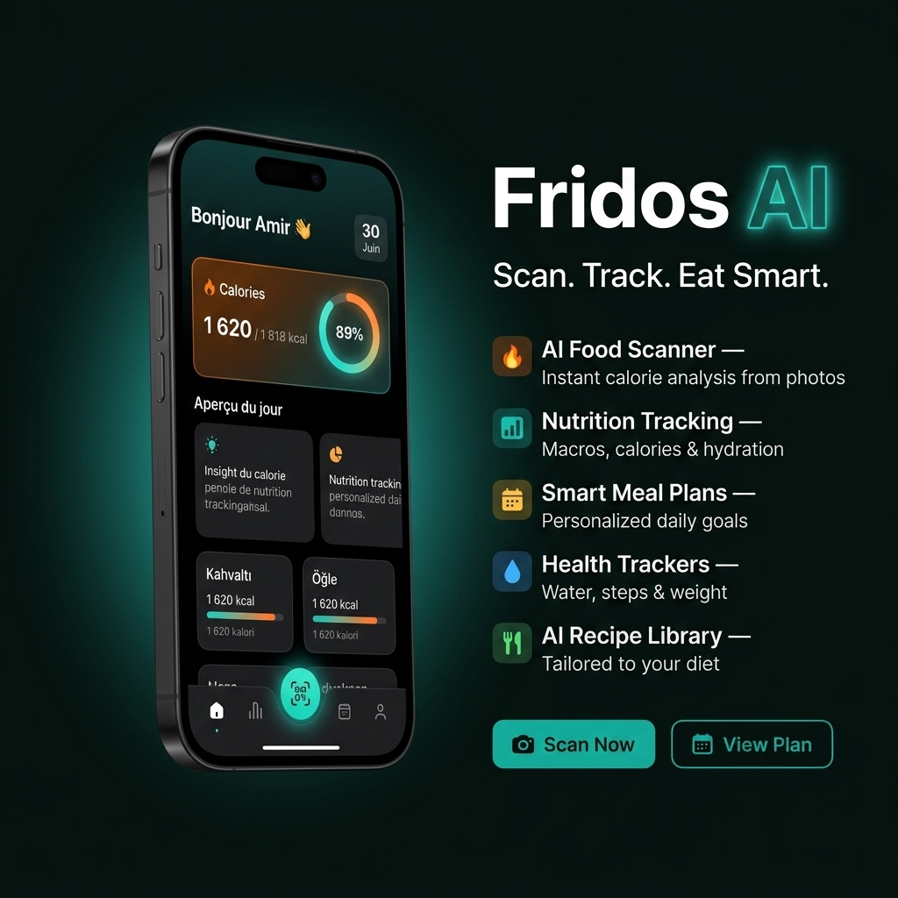

<div align="center">



<br/>
<br/>

[](https://expo.dev)
[](https://reactnative.dev)
[](https://www.typescriptlang.org)
[](https://supabase.com)
[](https://anthropic.com)

**Scannez votre frigo, calculez vos calories et mangez intelligemment — propulsé par l'IA.**

[📱 Features](#-features) · [🧱 Tech Stack](#-tech-stack) · [🚀 Getting Started](#-getting-started) · [🔑 Environment](#-environment-variables) · [🧪 Tests](#-tests) · [📦 Builds](#-builds--eas-deployment)

</div>

---

## ✨ Features

| | Feature | Description |
|:---:|:---|:---|
| 📷 | **AI Fridge Scanner** | Photographiez vos ingrédients — l'IA les identifie instantanément (Claude Vision) |
| 🍽️ | **AI Meal Scanner** | Estimez calories & macros d'une assiette en 2 secondes depuis une photo |
| 🍳 | **Smart Recipes** | Recettes triées par taux de correspondance avec vos ingrédients disponibles |
| 📊 | **Nutrition Tracking** | Objectifs personnalisés (BMR/TDEE), macros, eau, pas, poids en temps réel |
| 💡 | **Daily Insights** | Conseils contextuels intelligents (hydratation, protéines, calories…) |
| 🛒 | **Shopping List** | Générée automatiquement depuis les ingrédients manquants de vos recettes |
| 👑 | **Premium Subscription** | Abonnement mensuel/annuel via RevenueCat + essai gratuit |
| 🌍 | **Multilingual** | Français 🇫🇷 · English 🇬🇧 · Türkçe 🇹🇷 |
| 🌗 | **Dark / Light Theme** | Thème "Aqua Fresh" sombre par défaut |

---

## 🧱 Tech Stack

```
┌─────────────────────────────────────────────────────────────────┐
│                        FRIDOS AI STACK                          │
├──────────────────┬──────────────────────────────────────────────┤
│ Mobile           │ React Native 0.81 + Expo SDK 54              │
│ Language         │ TypeScript (strict mode)                     │
│ Navigation       │ Expo Router (file-based)                     │
│ Architecture     │ New Architecture (Fabric + TurboModules)     │
│ State            │ React Context API (typed providers)          │
│ Animations       │ Reanimated 4 + Gesture Handler               │
├──────────────────┼──────────────────────────────────────────────┤
│ Backend          │ Supabase (Postgres + Auth + Storage + Funcs) │
│ AI Vision        │ Anthropic Claude (claude-opus-4-8)           │
│ Payments         │ RevenueCat (react-native-purchases)          │
├──────────────────┼──────────────────────────────────────────────┤
│ i18n             │ i18next + expo-localization                  │
│ Monitoring       │ Sentry                                       │
│ Testing          │ Jest (jest-expo)                             │
│ Build / Deploy   │ EAS Build + EAS Submit                       │
└──────────────────┴──────────────────────────────────────────────┘
```

---

## 🗂️ Project Architecture

Découpage en couches — logique métier isolée et testable indépendamment de l'UI :

```
fridos_app/
├── app/                    # Screens & navigation (Expo Router file-based)
│   ├── (auth)/             #   Login · Register · Password reset
│   ├── (onboarding)/       #   Profile setup & goal configuration
│   ├── (tabs)/             #   Plan · Recipes · Scan · Profile · Pro · Cart
│   ├── scan/               #   Camera & scan results
│   └── recipe/[id]         #   Recipe detail page
│
├── components/             # Reusable UI components (Button, Card, Sheet…)
├── context/                # Global state (1 typed provider per domain)
│   └── AppProviders.tsx    #   Root composition of all providers
│
├── services/               # Pure business logic — fully tested
│   ├── plan.ts             #   BMR, TDEE, caloric goals, macros, BMI
│   ├── nutrition.ts        #   Macro aggregation & scaling
│   ├── insights.ts         #   Daily smart advice generation
│   ├── summary.ts          #   Progress & weight trend
│   ├── shoppingList.ts     #   Fridge ↔ recipes matching
│   ├── recipeFilters.ts    #   Recipe filtering & recommendation
│   └── vision.ts           #   Bridge to AI Vision Edge Functions
│
├── lib/                    # Infrastructure (supabase, api, image, i18n…)
├── constants/              # Design tokens & data (colors, recipes)
├── locales/                # Translations — en / fr / tr
├── supabase/               # SQL schema, migrations & Edge Functions
└── __tests__/              # Unit tests for the services layer
```

> **Principle:** Components stay presentational. All calculation logic lives in `services/` (pure functions, no native deps → fully testable anywhere).

---

## 🚀 Getting Started

### Prerequisites

- **Node.js** ≥ 18
- **npm**
- **Expo CLI** (via `npx`)
- A **development build** — Expo Go alone is not sufficient (the app uses native modules: RevenueCat, Camera). See [Builds section](#-builds--eas-deployment).

### 1 · Install dependencies

```bash
npm install
```

### 2 · Configure environment

```bash
cp .env.example .env
# Fill in your real values (see Environment Variables below)
```

### 3 · Run the app

```bash
npm run ios       # Build + launch on iOS simulator / device
npm run android   # Build + launch on Android emulator / device
npm start         # Metro server only (for an already-installed dev build)
```

---

## 🔑 Environment Variables

All `EXPO_PUBLIC_*` keys are **public by design** (protected server-side by Supabase RLS / RevenueCat backend). **Secrets** (Anthropic API key, service-role key) live **only** in Supabase Edge Functions — never in the app bundle.

| Variable | Description |
|:---|:---|
| `EXPO_PUBLIC_SUPABASE_URL` | Supabase project URL |
| `EXPO_PUBLIC_SUPABASE_ANON_KEY` | Supabase anonymous key (public, RLS-protected) |
| `EXPO_PUBLIC_REVENUECAT_IOS_KEY` | RevenueCat iOS SDK key (`appl_…`) |
| `EXPO_PUBLIC_REVENUECAT_ANDROID_KEY` | RevenueCat Android SDK key (`goog_…`) |
| `EXPO_PUBLIC_SENTRY_DSN` | Sentry public DSN (optional) |

---

## 🛠️ Backend · Supabase

### Database

- Schema: `supabase/schema.sql`
- Migrations: `supabase/migrations/`
- **Security:** RLS enabled on all tables — users access only their own data. `ON DELETE CASCADE` constraints ensure clean account deletion.

### Edge Functions

AI and privileged operations run **server-side** to keep secrets out of the app.

| Function | Role | Required Secret |
|:---|:---|:---|
| `detect-ingredients` | Vision: fridge ingredient detection | `ANTHROPIC_API_KEY` |
| `detect-meal` | Vision: meal nutrition analysis | `ANTHROPIC_API_KEY` |
| `delete-account` | Account deletion (cascade) | *(auto: `SUPABASE_*`)* |
| `revenuecat-webhook` | Subscription sync | *(RevenueCat config)* |

**Deploy:**

```bash
# Set shared secret for AI vision (never goes into the app)
supabase secrets set ANTHROPIC_API_KEY=sk-ant-...

supabase functions deploy detect-ingredients
supabase functions deploy detect-meal
supabase functions deploy delete-account
supabase functions deploy revenuecat-webhook
```

> `supabase.functions.invoke` automatically attaches the signed-in user's JWT → auth verification passes with no extra config.

---

## 🧪 Tests

Unit tests cover the entire `services/` layer (pure calculation logic):

```bash
npm test              # Run full test suite
npm run test:watch    # Watch mode
npm run typecheck     # TypeScript check (tsc --noEmit)
```

**Coverage:** `plan` · `nutrition` · `summary` · `insights` · `shoppingList` · `recipeFilters`

---

## 📦 Builds · EAS Deployment

Build profiles defined in `eas.json`:

```bash
# Development build (native modules, internal simulator/device)
eas build --profile development --platform ios
eas build --profile development --platform android

# Internal preview
eas build --profile preview --platform all

# Production (auto-increment version)
eas build --profile production --platform all
eas submit --profile production --platform all
```

> ⚠️ The app has only been tested on **iOS** so far. Please test a full **Android build** before publishing (keyboard, safe-area/gestures, notifications, RevenueCat in-app purchases).

---

## 🧮 Nutrition Calculation Logic

| Calculation | Method |
|:---|:---|
| Basal Metabolic Rate (BMR) | **Mifflin-St Jeor** equation |
| Total Daily Energy (TDEE) | BMR × activity factor (1.2 / 1.45 / 1.7) |
| Caloric goal | TDEE − deficit (per target pace), floored at BMR × 1.1 |
| Macros | Split by diet type (healthy / keto / vegan / …) |
| Per-meal goals | 30 % / 35 % / 25 % / 10 % (breakfast / lunch / dinner / snack) |
| Hydration | 35 ml per kg of body weight |
| Weight loss rate | deficit × 7 / 7700 kcal per kg |
| BMI | weight / height² + WHO categorisation |

> These calculations run **client-side** — no secrets needed, instantaneous, and fully offline.

---

## 📐 Code Conventions

- ✅ **TypeScript strict** — shared types, no `any`
- ✅ **No hardcoded values** — colors/spacing via theme tokens; keys via `.env`
- ✅ **Systematic i18n** — no raw strings in JSX, everything goes through `locales/`
- ✅ **Pure logic in `services/`**, presentation in `components/`, state in `context/`
- ✅ **Platform-specific code** isolated via `Platform.OS` / `Platform.select`

---

<div align="center">

Built with ❤️ and 🥑 by **Amir Hissein**

[](https://github.com/Amir-hissein)

</div>
